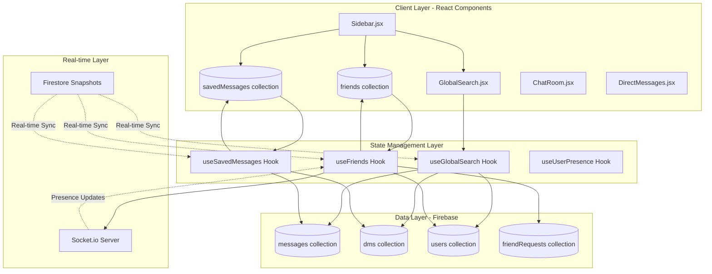
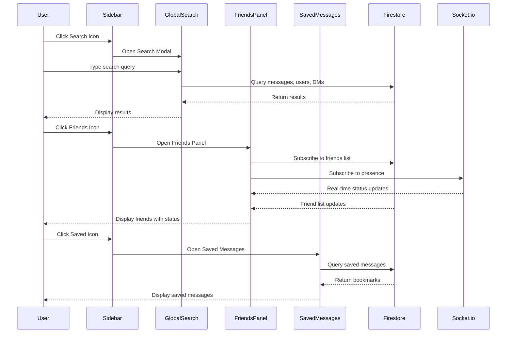

# Design Document: Chatter Sidebar Phase 1 Features

## Overview

This design document outlines the comprehensive technical implementation for three essential sidebar features in the Chatter chat application: Global Search, Friends/Contacts Management, and Saved Messages. These features enhance user experience by providing quick access to conversations, efficient message discovery, and personal message organization.

The implementation integrates seamlessly with the existing React + Firebase (Firestore) architecture, Socket.io real-time communication system, and Instagram-style collapsible sidebar design. All features support mobile responsive design with the existing BottomNav component.

## Architecture

### System Architecture



### Component Integration Flow



## Components and Interfaces

### Component 1: GlobalSearch

**Purpose**: Provides unified search across messages, users, and conversations with real-time results

**Interface**:
```typescript
interface GlobalSearchProps {
  user: User
  onResultClick: (result: SearchResult) => void
  onClose: () => void
}

interface SearchResult {
  type: 'message' | 'user' | 'dm'
  id: string
  content: string
  displayName?: string
  photoURL?: string
  timestamp?: Timestamp
  conversationId?: string
  messageId?: string
}
```

**Responsibilities**:
- Accept search input with debouncing (300ms)
- Query Firestore collections in parallel
- Display categorized results (Messages, Users, Conversations)
- Navigate to selected result
- Highlight search terms in results
- Handle empty states and loading states

### Component 2: FriendsPanel

**Purpose**: Manages friend list with online status, friend requests, and quick DM access

**Interface**:
```typescript
interface FriendsPanelProps {
  user: User
  onStartDM: (friendId: string) => void
  showNotification: (notification: Notification) => void
}

interface Friend {
  id: string
  displayName: string
  photoURL: string
  online: boolean
  lastSeen: Timestamp
}

interface FriendRequest {
  id: string
  from: string
  to: string
  fromName: string
  fromPhotoURL: string
  createdAt: Timestamp
}
```

**Responsibilities**:
- Display friends list sorted by online status
- Show real-time online/offline indicators
- Display pending friend requests with accept/reject actions
- Integrate with existing friend request system in DirectMessages
- Provide quick DM button for each friend
- Show friend count badges

### Component 3: SavedMessages

**Purpose**: Allows users to bookmark and organize important messages for later reference

**Interface**:
```typescript
interface SavedMessagesProps {
  user: User
  onMessageClick: (messageId: string, conversationId: string) => void
}

interface SavedMessage {
  id: string
  userId: string
  messageId: string
  conversationType: 'global' | 'dm'
  conversationId?: string
  messageText: string
  messageSender: string
  messageSenderPhoto: string
  messageTimestamp: Timestamp
  savedAt: Timestamp
  note?: string
}
```

**Responsibilities**:
- Display all saved messages in chronological order
- Show message context (sender, timestamp, conversation)
- Provide unsave/remove bookmark action
- Navigate to original message location
- Support optional personal notes on bookmarks
- Handle empty state when no saved messages

## Data Models

### Firestore Collections

#### savedMessages Collection
```typescript
{
  // Document ID: auto-generated
  userId: string              // User who saved the message
  messageId: string           // Reference to original message
  conversationType: 'global' | 'dm'
  conversationId: string      // DM ID or 'global'
  messageText: string         // Cached message content
  messageSender: string       // Cached sender name
  messageSenderPhoto: string  // Cached sender photo
  messageTimestamp: Timestamp // Original message time
  savedAt: Timestamp          // When bookmark was created
  note: string                // Optional user note
}
```

**Indexes Required**:
- `userId` ASC, `savedAt` DESC (for user's saved messages query)
- `userId` ASC, `messageId` ASC (for checking if message is saved)

#### friends Collection (existing)
```typescript
{
  // Document ID: auto-generated
  users: string[]             // Array of 2 user IDs (sorted)
  createdAt: Timestamp
}
```

#### friendRequests Collection (existing)
```typescript
{
  // Document ID: auto-generated
  from: string                // Sender user ID
  to: string                  // Recipient user ID
  fromName: string            // Cached sender name
  fromPhotoURL: string        // Cached sender photo
  createdAt: Timestamp
}
```

#### users Collection (existing - extended)
```typescript
{
  // Document ID: user UID
  uid: string
  displayName: string
  email: string
  photoURL: string
  lastSeen: Timestamp
  online: boolean             // Real-time presence
  isAnonymous: boolean
}
```

## Algorithmic Pseudocode

### Search Algorithm

```pascal
ALGORITHM performGlobalSearch(query, userId)
INPUT: query (search string), userId (current user ID)
OUTPUT: results (categorized search results)

BEGIN
  ASSERT query.length >= 2  // Minimum search length
  ASSERT userId is valid
  
  // Normalize search query
  normalizedQuery ← query.trim().toLowerCase()
  
  // Initialize result containers
  messageResults ← []
  userResults ← []
  dmResults ← []
  
  // Step 1: Search global messages (parallel query)
  PARALLEL BEGIN
    // Query 1: Search in global messages
    globalQuery ← query(
      collection: 'messages',
      where: 'text' contains normalizedQuery,
      orderBy: 'createdAt' DESC,
      limit: 20
    )
    messageResults ← execute(globalQuery)
    
    // Query 2: Search in users
    userQuery ← query(
      collection: 'users',
      where: 'displayName' contains normalizedQuery,
      where: 'isAnonymous' == false,
      limit: 10
    )
    userResults ← execute(userQuery)
    
    // Query 3: Search in DM conversations
    friendsQuery ← query(
      collection: 'friends',
      where: 'users' arrayContains userId
    )
    friendsList ← execute(friendsQuery)
    
    FOR each friendship IN friendsList DO
      otherUserId ← friendship.users.find(id => id != userId)
      dmId ← getDMId(userId, otherUserId)
      
      dmQuery ← query(
        collection: 'dms/' + dmId + '/messages',
        where: 'text' contains normalizedQuery,
        orderBy: 'createdAt' DESC,
        limit: 10
      )
      dmMessages ← execute(dmQuery)
      dmResults.append(dmMessages)
    END FOR
  END PARALLEL
  
  // Step 2: Combine and categorize results
  results ← {
    messages: messageResults,
    users: userResults,
    dms: dmResults
  }
  
  ASSERT results.messages.length <= 20
  ASSERT results.users.length <= 10
  
  RETURN results
END
```

**Preconditions:**
- query is non-empty string with length >= 2
- userId is valid and authenticated
- User has read permissions for queried collections

**Postconditions:**
- Returns categorized results object
- Each category contains at most the specified limit
- Results are ordered by relevance (timestamp DESC)
- No duplicate results within categories

**Loop Invariants:**
- All processed friendships have valid user IDs
- DM queries only access conversations user is part of
- Result arrays maintain chronological order

### Friend Status Update Algorithm

```pascal
ALGORITHM updateFriendPresence(friendId, isOnline, lastSeen)
INPUT: friendId (user ID), isOnline (boolean), lastSeen (timestamp)
OUTPUT: updatedFriend (friend object with current status)

BEGIN
  ASSERT friendId is valid
  ASSERT lastSeen is valid timestamp
  
  // Step 1: Fetch friend data
  friendDoc ← getDocument('users', friendId)
  
  IF friendDoc does not exist THEN
    RETURN null
  END IF
  
  // Step 2: Determine actual online status
  currentTime ← now()
  timeSinceLastSeen ← currentTime - lastSeen
  
  // Consider user online if:
  // - online flag is true AND
  // - lastSeen is within last 2 minutes
  actuallyOnline ← isOnline AND (timeSinceLastSeen < 120 seconds)
  
  // Step 3: Create updated friend object
  updatedFriend ← {
    id: friendId,
    displayName: friendDoc.displayName,
    photoURL: friendDoc.photoURL,
    online: actuallyOnline,
    lastSeen: lastSeen,
    status: IF actuallyOnline THEN 'online' 
            ELSE formatLastSeen(lastSeen)
  }
  
  RETURN updatedFriend
END
```

**Preconditions:**
- friendId exists in users collection
- lastSeen is valid Firestore timestamp
- isOnline is boolean value

**Postconditions:**
- Returns friend object with accurate online status
- Online status reflects both flag and recency
- lastSeen is formatted for display
- Returns null if friend not found

### Save Message Algorithm

```pascal
ALGORITHM saveMessage(userId, message, conversationType, conversationId)
INPUT: userId, message object, conversationType, conversationId
OUTPUT: savedMessageId (document ID of saved message)

BEGIN
  ASSERT userId is valid
  ASSERT message.id is valid
  ASSERT conversationType IN ['global', 'dm']
  
  // Step 1: Check if message is already saved
  existingQuery ← query(
    collection: 'savedMessages',
    where: 'userId' == userId,
    where: 'messageId' == message.id,
    limit: 1
  )
  existing ← execute(existingQuery)
  
  IF existing.length > 0 THEN
    THROW Error('Message already saved')
  END IF
  
  // Step 2: Create saved message document
  savedMessage ← {
    userId: userId,
    messageId: message.id,
    conversationType: conversationType,
    conversationId: conversationId,
    messageText: message.text.slice(0, 500),
    messageSender: message.displayName,
    messageSenderPhoto: message.photoURL,
    messageTimestamp: message.createdAt,
    savedAt: serverTimestamp(),
    note: ''
  }
  
  // Step 3: Save to Firestore
  docRef ← addDocument('savedMessages', savedMessage)
  
  ASSERT docRef.id is valid
  
  RETURN docRef.id
END
```

**Preconditions:**
- userId is authenticated user
- message object contains required fields (id, text, displayName, createdAt)
- conversationType is either 'global' or 'dm'
- Message is not already saved by this user

**Postconditions:**
- New document created in savedMessages collection
- Document contains cached message data
- Returns valid document ID
- Throws error if message already saved

**Loop Invariants:** N/A (no loops)

## Key Functions with Formal Specifications

### Function 1: searchMessages()

```typescript
function searchMessages(
  query: string,
  userId: string,
  limit: number = 20
): Promise<SearchResult[]>
```

**Preconditions:**
- `query` is non-empty string with `query.length >= 2`
- `userId` is valid authenticated user ID
- `limit` is positive integer, `limit > 0 && limit <= 100`
- User has read access to messages collection

**Postconditions:**
- Returns array of SearchResult objects
- `result.length <= limit`
- Results are ordered by `timestamp DESC`
- Each result contains valid message data
- No duplicate message IDs in results
- Query execution time < 2 seconds

**Loop Invariants:**
- All processed messages belong to accessible conversations
- Result array maintains chronological order throughout iteration

### Function 2: getFriendsWithStatus()

```typescript
function getFriendsWithStatus(
  userId: string
): Promise<Friend[]>
```

**Preconditions:**
- `userId` is valid authenticated user ID
- User document exists in users collection
- User has read access to friends collection

**Postconditions:**
- Returns array of Friend objects with current online status
- Online friends appear before offline friends
- Each friend has valid `id`, `displayName`, `online` status
- `online` status reflects actual presence (within 2 minutes)
- Array is sorted: online friends first, then by displayName
- No duplicate friend IDs in results

**Loop Invariants:**
- All processed friendships contain current user's ID
- Online status calculation remains consistent
- Friend list maintains sort order throughout processing

### Function 3: toggleSaveMessage()

```typescript
function toggleSaveMessage(
  userId: string,
  message: Message,
  conversationType: 'global' | 'dm',
  conversationId: string
): Promise<boolean>
```

**Preconditions:**
- `userId` is valid authenticated user ID
- `message` object contains required fields: `id`, `text`, `displayName`, `createdAt`
- `conversationType` is either `'global'` or `'dm'`
- If `conversationType === 'dm'`, then `conversationId` is valid DM ID
- User has write access to savedMessages collection

**Postconditions:**
- If message was not saved: creates new savedMessages document, returns `true`
- If message was already saved: deletes savedMessages document, returns `false`
- Operation is idempotent (can be called multiple times safely)
- Saved message contains cached data from original message
- `savedAt` timestamp is set to server time
- No side effects on original message document

**Loop Invariants:** N/A (no loops)

### Function 4: acceptFriendRequest()

```typescript
function acceptFriendRequest(
  requestId: string,
  fromUserId: string,
  toUserId: string
): Promise<void>
```

**Preconditions:**
- `requestId` is valid friendRequests document ID
- `fromUserId` and `toUserId` are valid user IDs
- Friend request document exists with matching IDs
- Users are not already friends
- Both users exist in users collection

**Postconditions:**
- Friend request document is deleted
- New friendship document created in friends collection
- `friendship.users` contains both user IDs in sorted order
- `friendship.createdAt` is set to server timestamp
- Both users can now send DMs to each other
- Operation is atomic (both operations succeed or both fail)

**Loop Invariants:** N/A (no loops)

## Example Usage

### Example 1: Global Search

```typescript
// User types in search box
const SearchComponent = ({ user }) => {
  const [query, setQuery] = useState('')
  const [results, setResults] = useState(null)
  const [loading, setLoading] = useState(false)
  
  // Debounced search
  useEffect(() => {
    if (query.length < 2) {
      setResults(null)
      return
    }
    
    const timer = setTimeout(async () => {
      setLoading(true)
      const searchResults = await searchMessages(query, user.uid)
      setResults(searchResults)
      setLoading(false)
    }, 300)
    
    return () => clearTimeout(timer)
  }, [query, user.uid])
  
  return (
    <div className="global-search">
      <input
        type="text"
        value={query}
        onChange={(e) => setQuery(e.target.value)}
        placeholder="Search messages, users..."
      />
      {loading && <Spinner />}
      {results && <SearchResults results={results} />}
    </div>
  )
}
```

### Example 2: Friends List with Online Status

```typescript
// Display friends with real-time presence
const FriendsPanel = ({ user }) => {
  const [friends, setFriends] = useState([])
  
  useEffect(() => {
    // Subscribe to friends list
    const q = query(
      collection(db, 'friends'),
      where('users', 'array-contains', user.uid)
    )
    
    return onSnapshot(q, async (snap) => {
      const friendIds = snap.docs.map(doc => {
        const data = doc.data()
        return data.users.find(id => id !== user.uid)
      })
      
      // Fetch friend details with status
      const friendsData = await Promise.all(
        friendIds.map(id => getFriendsWithStatus(id))
      )
      
      // Sort: online first, then alphabetically
      friendsData.sort((a, b) => {
        if (a.online !== b.online) return b.online - a.online
        return a.displayName.localeCompare(b.displayName)
      })
      
      setFriends(friendsData)
    })
  }, [user.uid])
  
  return (
    <div className="friends-panel">
      {friends.map(friend => (
        <FriendItem
          key={friend.id}
          friend={friend}
          onStartDM={() => startDM(friend.id)}
        />
      ))}
    </div>
  )
}
```

### Example 3: Save/Unsave Message

```typescript
// Toggle save message from context menu
const MessageActions = ({ message, user }) => {
  const [isSaved, setIsSaved] = useState(false)
  
  // Check if message is already saved
  useEffect(() => {
    const checkSaved = async () => {
      const q = query(
        collection(db, 'savedMessages'),
        where('userId', '==', user.uid),
        where('messageId', '==', message.id),
        limit(1)
      )
      const snap = await getDocs(q)
      setIsSaved(snap.docs.length > 0)
    }
    checkSaved()
  }, [message.id, user.uid])
  
  const handleToggleSave = async () => {
    const conversationType = message.dmId ? 'dm' : 'global'
    const conversationId = message.dmId || 'global'
    
    const newState = await toggleSaveMessage(
      user.uid,
      message,
      conversationType,
      conversationId
    )
    
    setIsSaved(newState)
  }
  
  return (
    <button onClick={handleToggleSave}>
      {isSaved ? '⭐ Saved' : '☆ Save'}
    </button>
  )
}
```

## Error Handling

### Error Scenario 1: Search Query Too Short

**Condition**: User types less than 2 characters in search box
**Response**: Do not execute search query, show placeholder text
**Recovery**: Wait for user to type more characters

### Error Scenario 2: Firestore Permission Denied

**Condition**: User attempts to access collection without proper permissions
**Response**: Catch permission error, show user-friendly message
**Recovery**: Log error for debugging, suggest user refresh or contact support

### Error Scenario 3: Network Timeout During Search

**Condition**: Search query takes longer than 5 seconds
**Response**: Cancel query, show timeout message
**Recovery**: Allow user to retry search, implement exponential backoff

### Error Scenario 4: Duplicate Save Attempt

**Condition**: User tries to save a message that's already saved
**Response**: Show toast notification "Message already saved"
**Recovery**: Update UI to reflect saved state, no database operation needed

### Error Scenario 5: Friend Request Already Accepted

**Condition**: User accepts friend request that was already processed
**Response**: Silently handle, ensure friendship exists
**Recovery**: Update UI to show current friendship status

## Testing Strategy

### Unit Testing Approach

Test individual functions and components in isolation:

- **Search Functions**: Test query building, result filtering, debouncing logic
- **Friend Status Logic**: Test online/offline determination, lastSeen formatting
- **Save/Unsave Logic**: Test bookmark creation, duplicate detection, removal
- **UI Components**: Test rendering, user interactions, state updates

**Key Test Cases**:
- Search with various query lengths (0, 1, 2, 50, 500 characters)
- Friend status with different lastSeen values (now, 1 min ago, 1 hour ago, 1 day ago)
- Save message when already saved vs not saved
- Accept friend request when already friends vs not friends

### Property-Based Testing Approach

**Property Test Library**: fast-check (for JavaScript/TypeScript)

**Property Tests**:

1. **Search Idempotency**: Searching same query twice returns same results
2. **Friend List Ordering**: Online friends always appear before offline friends
3. **Save Toggle**: Calling toggleSaveMessage twice returns to original state
4. **No Duplicate Results**: Search results never contain duplicate message IDs
5. **Timestamp Ordering**: Search results are always ordered by timestamp DESC

### Integration Testing Approach

Test component interactions with Firebase and Socket.io:

- **Search Integration**: Test actual Firestore queries with test data
- **Friends Real-time**: Test Socket.io presence updates trigger UI updates
- **Save Messages**: Test full flow from UI click to Firestore write to UI update
- **Friend Requests**: Test accept/reject flow updates both users' friend lists

**Integration Test Scenarios**:
- User searches, clicks result, navigates to correct message
- Friend comes online, status indicator updates in real-time
- User saves message, it appears in Saved Messages panel
- User accepts friend request, friend appears in Friends panel

## Performance Considerations

### Search Performance

- **Debouncing**: 300ms delay prevents excessive queries while typing
- **Query Limits**: Cap results at 20 messages, 10 users, 10 DMs per conversation
- **Parallel Queries**: Execute message, user, and DM queries concurrently
- **Index Optimization**: Ensure Firestore indexes exist for all query combinations
- **Client-side Caching**: Cache recent search results for 30 seconds

### Friends List Performance

- **Pagination**: Load first 50 friends immediately, lazy-load rest on scroll
- **Presence Batching**: Batch presence updates every 30 seconds instead of real-time
- **Snapshot Optimization**: Use Firestore snapshots only for friends collection, fetch user details on-demand
- **Memoization**: Memoize friend list sorting to avoid re-sorting on every render

### Saved Messages Performance

- **Lazy Loading**: Load 30 saved messages initially, load more on scroll
- **Cached Data**: Store message content in savedMessages document to avoid joins
- **Pagination**: Use Firestore `startAfter` for efficient pagination
- **Delete Optimization**: Batch delete operations when removing multiple bookmarks

## Security Considerations

### Access Control

- **Read Permissions**: Users can only read their own saved messages
- **Write Permissions**: Users can only create/delete their own saved messages
- **Search Scope**: Users can only search messages in conversations they're part of
- **Friend Requests**: Users can only accept requests sent to them

### Firestore Security Rules

```javascript
// savedMessages collection
match /savedMessages/{docId} {
  allow read: if request.auth.uid == resource.data.userId;
  allow create: if request.auth.uid == request.resource.data.userId
                && request.resource.data.messageId is string
                && request.resource.data.conversationType in ['global', 'dm'];
  allow delete: if request.auth.uid == resource.data.userId;
  allow update: if request.auth.uid == resource.data.userId
                && request.resource.data.userId == resource.data.userId;
}

// friends collection (existing)
match /friends/{docId} {
  allow read: if request.auth.uid in resource.data.users;
  allow create: if request.auth.uid in request.resource.data.users
                && request.resource.data.users.size() == 2;
  allow delete: if request.auth.uid in resource.data.users;
}

// friendRequests collection (existing)
match /friendRequests/{docId} {
  allow read: if request.auth.uid == resource.data.from
              || request.auth.uid == resource.data.to;
  allow create: if request.auth.uid == request.resource.data.from;
  allow delete: if request.auth.uid == resource.data.to
                || request.auth.uid == resource.data.from;
}
```

### Data Validation

- **Input Sanitization**: Sanitize search queries to prevent injection attacks
- **Message Length**: Limit cached message text to 500 characters
- **Rate Limiting**: Limit search queries to 10 per minute per user
- **XSS Prevention**: Escape user-generated content in search results

## Dependencies

### Existing Dependencies (Already in Project)

- **React** (^18.x): UI framework
- **Firebase** (^10.x): Firestore, Authentication
  - `firebase/firestore`: Database operations
  - `firebase/auth`: User authentication
- **Socket.io Client** (^4.x): Real-time presence updates
- **React Hooks**: useState, useEffect, useCallback, useRef, useMemo

### New Dependencies (None Required)

All features can be implemented using existing dependencies. No new packages needed.

### Firestore Indexes Required

Create these composite indexes in Firebase Console:

1. **savedMessages Collection**:
   - `userId` (Ascending) + `savedAt` (Descending)
   - `userId` (Ascending) + `messageId` (Ascending)

2. **messages Collection** (if not exists):
   - `createdAt` (Descending)

3. **users Collection** (if not exists):
   - `displayName` (Ascending) + `isAnonymous` (Ascending)

### Socket.io Events (New)

Add these event handlers to existing Socket.io server:

- `presence-update`: Broadcast when user goes online/offline
- `friend-request-sent`: Notify recipient of new friend request
- `friend-request-accepted`: Notify sender that request was accepted

## Mobile Responsive Design

### Sidebar Behavior

- **Desktop**: Collapsible sidebar (icons-only collapsed, expands on hover)
- **Mobile**: Use existing BottomNav component for navigation
- **Tablet**: Full sidebar visible by default

### Search Modal

- **Desktop**: Modal overlay (600px width, centered)
- **Mobile**: Full-screen modal with back button
- **Keyboard**: Escape key closes modal, Enter key selects first result

### Friends Panel

- **Desktop**: Sidebar panel (300px width)
- **Mobile**: Full-screen view with back button
- **Tablet**: Slide-out panel from right side

### Saved Messages

- **Desktop**: Main content area (replaces chat view)
- **Mobile**: Full-screen view with back button
- **Tablet**: Main content area with sidebar visible

## Implementation Notes

### Integration with Existing Code

1. **Sidebar.jsx**: Add three new navigation items (Search, Friends, Saved)
2. **ChatRoom.jsx**: Add search modal state and handler
3. **DirectMessages.jsx**: Integrate FriendsPanel component
4. **Message Components**: Add save/unsave button to message actions
5. **BottomNav.jsx**: Add mobile navigation for new features

### State Management

Use React hooks for local state management:
- `useState` for component state
- `useEffect` for Firestore subscriptions
- `useCallback` for memoized functions
- `useMemo` for expensive computations
- Custom hooks for reusable logic (useGlobalSearch, useFriends, useSavedMessages)

### Real-time Updates

- **Firestore Snapshots**: Use `onSnapshot` for real-time data sync
- **Socket.io**: Use for presence updates and friend request notifications
- **Optimistic Updates**: Update UI immediately, sync with server in background

### Accessibility

- **Keyboard Navigation**: Support Tab, Enter, Escape keys
- **ARIA Labels**: Add proper labels to all interactive elements
- **Screen Reader**: Announce search results and status changes
- **Focus Management**: Trap focus in modals, restore focus on close

### Performance Optimization

- **Code Splitting**: Lazy load search and saved messages components
- **Virtualization**: Use virtual scrolling for long friend lists
- **Debouncing**: Debounce search input (300ms)
- **Memoization**: Memoize expensive computations and renders
- **Pagination**: Load data in chunks (30-50 items at a time)

---

**Status**: Design Document Complete
**Created**: 2026
**Last Updated**: 2026
**Feature Name**: phase-1-sidebar-features
**Workflow Type**: design-first
